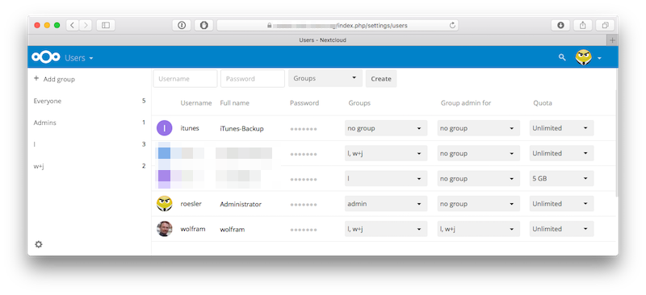
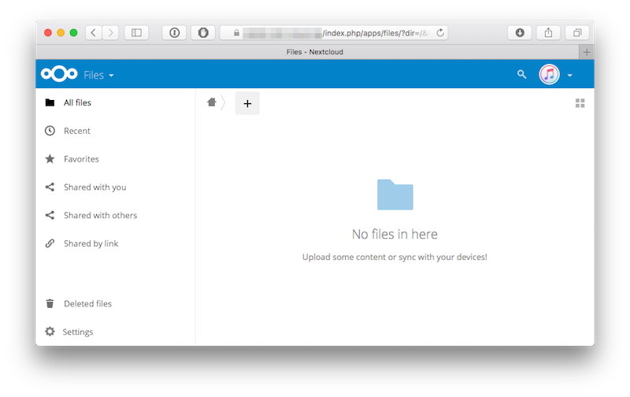
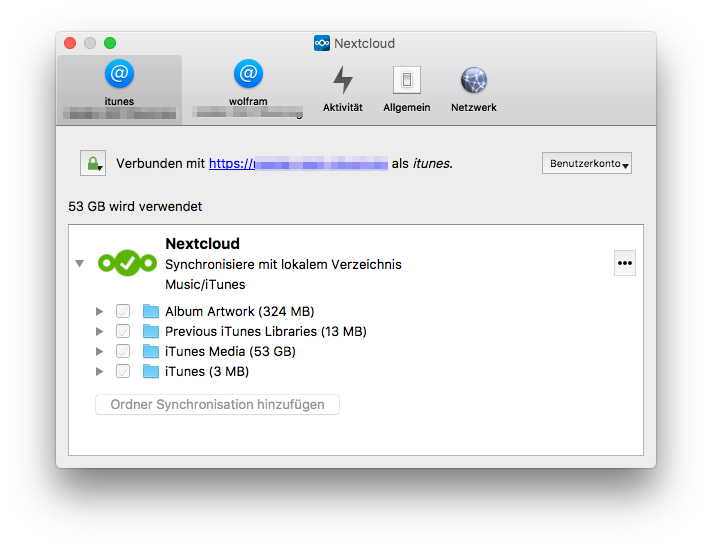

# How to back up your iTunes files to Nextcloud

This guide explains how to back up your iTunes files (music, videos, ring tones, e-books, iPhone backups, etc.) to your Nextcloud in macOS. It assumes that ...

* you are familiar with the Unix shell (aka Terminal)
* the Nextcloud client software is configured and running

This guide was developed using:

* macOS Sierra
* iTunes 12.5.5.5
* Nextcloud 2.2.4

## Before you start

Do this at your own risk. Make sure you have a good backup in case you mess up something, or in case there's a bug in this document. Time Machine is your friend. Read and understand the shell command lines before executing them.

Make sure you have enough space available in your Nextcloud.

Please note that the following serves as a backup of your iTunes data. It is not suitable for sharing your iTunes files across several iTunes instances; trying to do so will most certainly mess things up badly.

## How it does not work

The first idea is to create symlinks to the iTunes directories from your cloud-synced folder, for example:

```sh
$ cd ~/Dropbox
$ mkdir iTunes
$ cd iTunes
$ for i in Books Downloads "Home Videos" "Mobile Applications" Movies Music Tones "Voice Memos"; do
>   ln -s "~/Music/iTunes/iTunes Media/$i" .
> done
```

This will work fine with Dropbox (as shown above) but not with Nextcloud because the Nextcloud client software doesn't follow symlinks.

The second idea is to do it the other way around, move your iTunes folders into a cloud-synced directory and set up symlink to make iTunes find them:

```sh
$ mkdir ~/Nextcloud/iTunes
$ cd "~/Music/iTunes/iTunes Media"
$ for i in Books Downloads "Home Videos" "Mobile Applications" Movies Music Tones "Voice Memos"; do
>   mv "$i" ~/Nextcloud/iTunes && ln -s "~/Nextcloud/iTunes/$i" .
> done
```

This will back up your iTunes files to Nextcloud all right, but it breaks stuff in iTunes. For example, you'll still be able to play music, but dragging mp3 files into iTunes will fail with an error message. Bummer.

## How it does work

TL;DR: Create a new user account in Nextcloud, then set up your Nextcloud client software to sync your iTunes folder into it.

First, open Nextcloud in your browser, log in as adminstrator, and go to the user admininistration panel. Create a new user called "itunes", and give it a nice secure password.



Log off from Nextcloud, log on as user "itunes", and delete all the files and folders. These are the default files that Nextcloud creates in a new account, we don't need them here. While you're at it, set the user picture to a nice iTunes logo you pick off the web.



Open the Nextcloud client configuration on your Mac. Pick "Add new user account", and enter your server address, followed by user name "itunes" and the password you specified above. As "Local folder", specify your `~/Music/iTunes` folder. WARNING: Be sure to select "Keep local files"!



Your Nextcloud client is now set up to sync two Nextcloud accounts to your Mac: Your regular user account which syncs to ~/Nextcloud (usually), and the special "itunes" account which syncs your iTunes folder. Nothing has changed in the iTunes configuration, and iTunes won't realize that anything special is happening. Nextcloud, on the other hand, will automatically pick up all changes to your iTunes files and back them up to the cloud. Voilà!

## Mobile Device Backups

The symlink-into-Nextcloud works fine with mobile backups, however:

```sh
$ cd "~/Library/Application Support/MobileSync"
$ mv Backup && ~/Nextcloud/iTunes && ln -s ~/Nextcloud/iTunes/Backup/ .
```

iTunes doesn't mind having a symlink here, so iPhone/iPad/iPod backups go into the cloud just fine.

*Wolfram Rösler • wolfram@roesler-ac.de • https://twitter.com/wolframroesler • https://github.com/wolframroesler*
